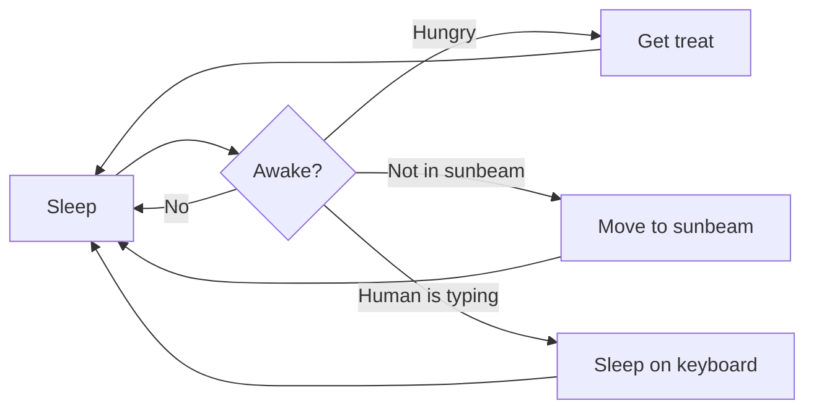

# Markdown All in One

### Hello guys!

Welcome to Markdown All in One video demo.

## Table of Contents
- [Markdown All in One](#markdown-all-in-one)
    - [Hello guys!](#hello-guys)
  - [Table of Contents](#table-of-contents)
  - [Introduction](#introduction)
  - [Objectives](#objectives)
  - [Commands](#commands)
  - [Images](#images)
- [References](#references)
- [Mermaid](#mermaid)
- [Math formula rendering](#math-formula-rendering)

## Introduction
Markdown All in One is a VS Code extension..

## Objectives
Learning Outcomes here...
The goal we want to achieved

## Commands
  - Snippets:
       **Ctrl + Space** 
     - (Trigger Suggestions)
  - Go to Header File:
        **Ctrl + Shift + O**
     - to quickly jump to a header in the current file

## Images
Examples:
1. **Using html tags and elements - customization**
   
   

2. **Simple Markdown built-in function**
   

   - Make sure you already downloaded the picture and it's in the folder of this project.

# References 
`https://code.visualstudio.com/docs/languages/markdown`

# Mermaid

----------

# Math formula rendering

Math block:

$$
\displaystyle
\left( \sum_{k=1}^n a_k b_k \right)^2
\leq
\left( \sum_{k=1}^n a_k^2 \right)
\left( \sum_{k=1}^n b_k^2 \right)
$$

